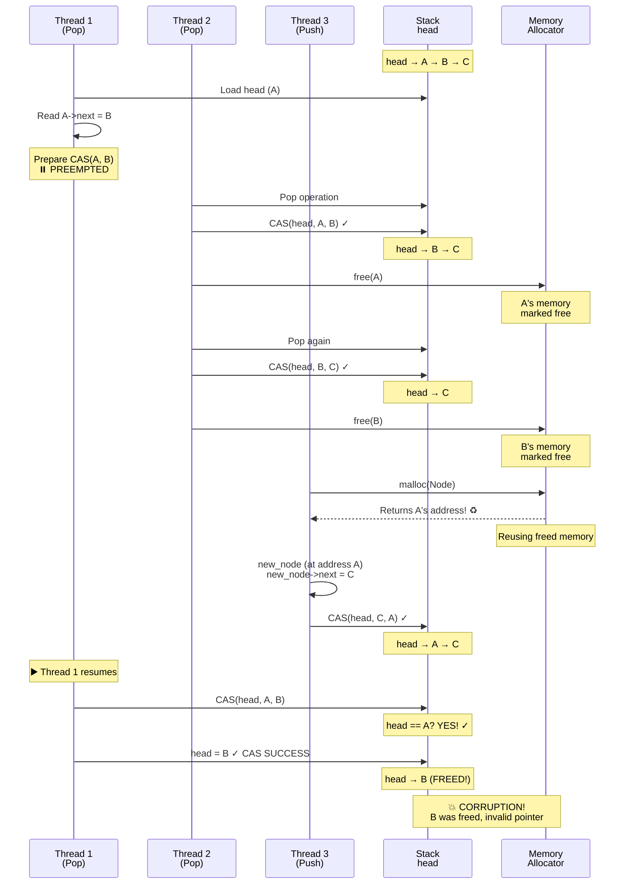
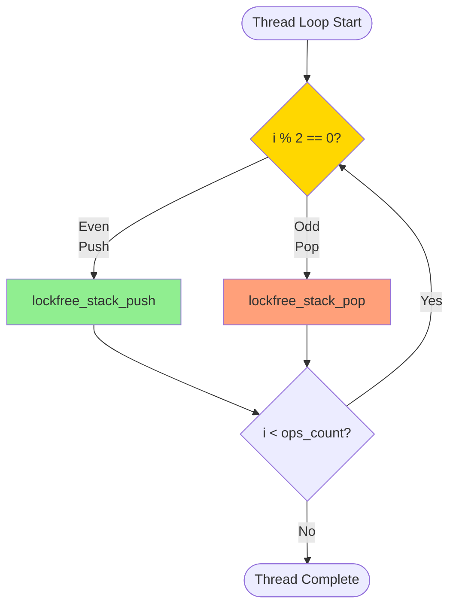
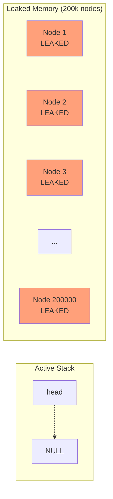
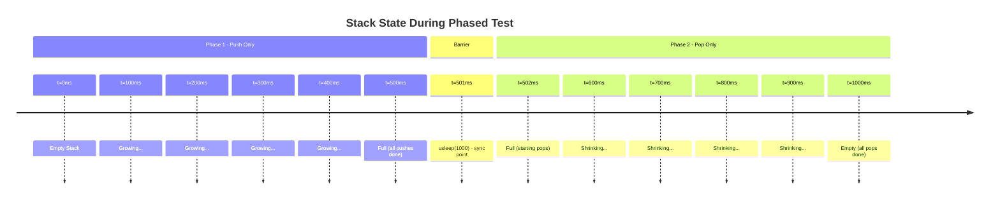
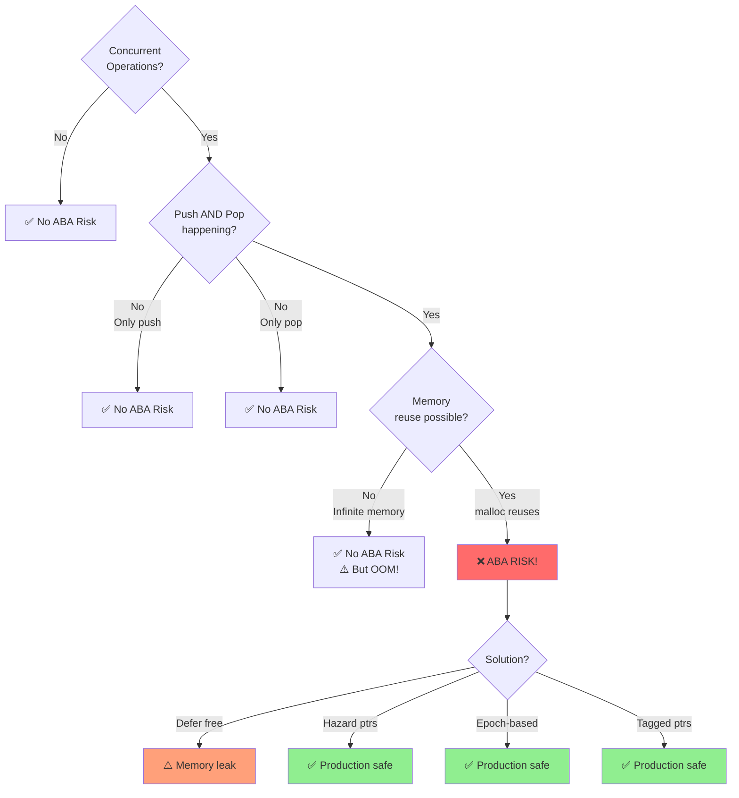

# Exercise 8 ABA: ABA Problem Demonstration - Visual Documentation

## Overview

This document provides visual explanations of the **ABA problem** demonstrated in `exercise8_aba.c`.

⚠️ **WARNING:** This exercise intentionally triggers the ABA problem and leaks memory to avoid crashes!

---

## 1. The ABA Problem Explained

### What is the ABA Problem?

The **ABA problem** occurs when:
1. Thread 1 reads value A
2. Thread 2 changes A → B → A (appears unchanged!)
3. Thread 1's CAS succeeds (sees A)
4. **But it's a different A!** Data structure is now corrupted.

---

## 2. ABA Problem Timeline (Step-by-Step)

```
Initial Stack State: head → A → B → C

Time    Thread 1              Thread 2         Thread 3         Stack State
────────────────────────────────────────────────────────────────────────────
t0                                                              head → A → B → C

t1      Load head (A)                                          head → A → B → C
        Read A->next (B)
        Prepare: CAS(A, B)

        ⏸️ PREEMPTED!
        (Thread 1 paused
         before CAS)

t2                            Pop A            ──────────────>  head → B → C
                              free(A) 💥

t3                                             Pop B            head → C
                                               free(B) 💥

t4                                             Push X           head → X → C
                                               malloc() returns A! ⚠️
                                               (memory reused)

        Note: malloc reused the freed memory from A
        So the pointer value is A again, but it's NEW data!

t5      ▶️ Thread 1 resumes
        CAS(head, A, B)
        Check: head == A?
        YES! ✓ (pointer matches)       ──────────────>  head → B (OLD!)

        CAS SUCCEEDS! ✅

        But B was freed at t3! 💥

t6                                                              head → B (INVALID!)
                                                                B->next = ???

t7      Next operation tries                                   💥 SEGFAULT
        to access B->next                                      or
        or someone frees B again                               💥 DOUBLE-FREE!
```

**The Problem:**
- Thread 1 thinks head is still the "original A"
- But it's actually a "new A" (reused memory)
- Thread 1's CAS succeeds even though the structure changed
- Result: head points to freed memory (B) → **CRASH!**

---

## 3. ABA Sequence Diagram



**Key Insight:** The pointer value (address A) matches, but it's not the same object!

---

## 4. Concurrent Push/Pop Pattern (Triggers ABA)



**Why This Triggers ABA:**
- Thread 1: Push (allocates node)
- Thread 2: Pop (frees node)
- Thread 3: Push (reuses freed memory) ← **ABA risk!**
- Thread 1: Pop (CAS with stale pointer)

---

## 5. Memory Reclamation Trade-off

```mermaid
graph TB
    subgraph "Option 1: Immediate Free (exercise8_aba.c would crash)"
        Pop1[Pop succeeds] --> Free1[free old_head]
        Free1 --> Malloc1[malloc in another thread]
        Malloc1 --> Reuse1[Reuses same address]
        Reuse1 --> ABA1[ABA: CAS succeeds with stale pointer]
        ABA1 --> Crash1[💥 CRASH: double-free or segfault]
    end

    subgraph "Option 2: Deferred Free (exercise8_aba.c actual)"
        Pop2[Pop succeeds] --> NoFree[Skip free old_head]
        NoFree --> Track[leaked_nodes++]
        Track --> Safe[✓ No crash]
        Safe --> Leak[❌ Memory leak!]
    end

    subgraph "Option 3: Production Solutions"
        Pop3[Pop succeeds] --> HazardPtr[Check hazard pointers]
        HazardPtr --> InUse{Node in use?}
        InUse -->|Yes| Defer[Defer reclamation]
        InUse -->|No| SafeFree[✓ Safe to free]
        Defer --> Epoch[Wait for epoch/grace period]
        Epoch --> SafeFree
    end

    style Crash1 fill:#FF6B6B
    style Leak fill:#FFA07A
    style SafeFree fill:#90EE90
```



**Three Approaches:**

1. **Immediate Free:** Fast but crashes (ABA problem)
2. **Deferred/Never Free:** Safe but leaks memory
3. **Proper Reclamation:** Safe AND no leaks (production solution)

---

## 6. Production Solutions Comparison

| Solution | How It Works | Pros | Cons |
|----------|--------------|------|------|
| **Hazard Pointers** | Thread marks pointer as "in use"<br/>Defer free until unmarked | • Predictable overhead<br/>• Per-thread control | • Complex implementation<br/>• Limited hazard slots |
| **Epoch-Based** | Track global epoch counter<br/>Free nodes from old epochs | • Simple concept<br/>• Low overhead | • Grace period delay<br/>• All threads must advance |
| **Reference Counting** | Increment count on access<br/>Free when count → 0 | • Precise lifetime tracking | • Atomic inc/dec overhead<br/>• Can have ABA on count! |
| **Tagged Pointers** | Pack version counter with pointer<br/>CAS checks both pointer+version | • No ABA possible<br/>• Simple | • Platform-dependent<br/>• Limits pointer range |
| **RCU** | Readers never block<br/>Writers defer updates | • Very fast reads<br/>• Linux kernel proven | • Complex API<br/>• Read-mostly workloads |

---

## 7. exercise8_aba.c Output Explanation

```
=== Exercise 8 ABA: Lock-Free Stack with ABA Problem ===

⚠ WARNING: This exercise demonstrates the ABA problem!
   Memory is deliberately leaked to avoid crashes.
```

### Part 1: Correctness Test
```
Testing lock-free stack...
  Pushing 100000 items from 4 threads...
  Popping all items...
  ✓ All 400000 items accounted for
  ✓ No duplicates found
  ✓ Lock-free stack: CORRECT
```
✅ **Works because:** Only pushing in correctness test (no concurrent pop = no ABA)

### Part 2: Performance Test
```
Lock-free stack:
  Total operations: 400000
  Time: 0.856 seconds
  Throughput: 467290 ops/sec
  Avg latency: 2.14 µs
  CAS retries: 45623 (11.4%)
  Leaked nodes: 200000 (deferred reclamation)  ⚠️
  ⚠ Memory leak: 200000 nodes not freed to avoid ABA crashes!
```

**Key Metrics:**
- **CAS retries:** 11.4% shows moderate contention from concurrent operations
- **Leaked nodes:** 200,000 = all popped nodes (400k ops, 50% are pops)
- **Why leak?** The `free(old_head)` is commented out to prevent double-free crashes

---

## 8. Visualizing the Leak



**After performance test:**
- Stack is empty (head → NULL)
- But 200,000 nodes still in memory
- Never freed (deferred reclamation)
- Process terminates → OS reclaims all

---

## 9. Why Phased Approach (exercise8.c) Avoids ABA



**Why No ABA:**
- **Phase 1:** Only allocating (malloc), never freeing
  - No freed memory to reuse
  - No ABA possible
- **Phase 2:** Only freeing (free), never allocating
  - No new allocations to reuse freed memory
  - No ABA possible

**Critical Insight:** ABA requires **concurrent** malloc and free of same memory!

---

## 10. Flowchart: When Does ABA Occur?



---

## Summary

### exercise8_aba.c demonstrates:
- ❌ **ABA Problem:** Concurrent push/pop causes it
- ❌ **Double-Free Risk:** Without deferred reclamation
- ⚠️ **Memory Leak:** Trade-off to avoid crashes
- ✅ **Educational Value:** Shows WHY production needs proper reclamation

### Key Takeaways:
1. Simple `malloc`/`free` is **NOT safe** with lock-free structures
2. ABA occurs when memory is reused during CAS operations
3. Production code needs **hazard pointers**, **epochs**, or **tagged pointers**
4. Deferring free "works" but leaks memory - not a real solution

### Comparison:

| | exercise8.c | exercise8_aba.c |
|---|---|---|
| **ABA Risk** | ✗ Avoided (phased) | ✓ Triggered (concurrent) |
| **Memory Management** | ✓ Clean | ✗ Leaks |
| **Purpose** | Show it works | Show why it's hard |

**For safe implementation, see `exercise8.c` and `exercise8_diagrams.md`**
