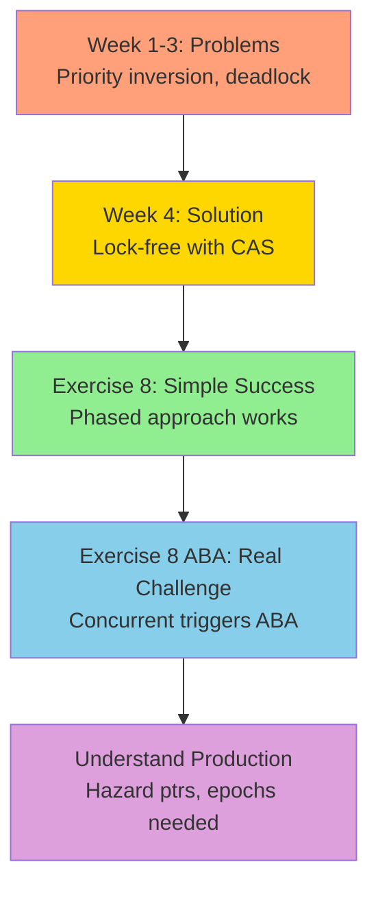

# Exercise 8: Design Rationale - Why CAS and Linked Lists?

## Table of Contents
1. [Why Compare-And-Swap (CAS)?](#1-why-compare-and-swap-cas)
2. [Why Linked List of Nodes?](#2-why-linked-list-of-nodes)
3. [Pedagogical Approach](#3-pedagogical-approach)
4. [Implementation Details Explained](#4-implementation-details-explained)
5. [Dynamic Nodes vs Fixed Array](#5-dynamic-nodes-vs-fixed-array)
6. [Alternative Approaches Considered](#6-alternative-approaches-considered)
7. [Summary](#7-summary)

---

## 1. Why Compare-And-Swap (CAS)?

### The Core Problem with Locks

Traditional mutex-based synchronization has fundamental issues in real-time systems:

| Problem | Impact on RT Systems | Example |
|---------|---------------------|---------|
| **Priority Inversion** | High-priority thread blocked by low-priority thread holding lock | Week 2: Exercise 4 demonstrates this |
| **Deadlock** | Circular wait on locks → system hangs | Week 3: Exercises 6 & 7 |
| **Blocking** | Thread waits indefinitely for lock | Unpredictable latency |
| **Contention** | Lock becomes bottleneck under high load | Poor scalability |

**Real-world example:** Mars Pathfinder (1997) - System resets due to priority inversion!

### CAS as the Solution

**Compare-And-Swap (CAS)** is a hardware-supported atomic operation:

```c
bool CAS(T* ptr, T expected, T new_value) {
    atomic {  // Happens in ONE CPU instruction - cannot be interrupted
        if (*ptr == expected) {
            *ptr = new_value;
            return true;   // Success: value was expected, now updated
        }
        return false;      // Failure: value changed, retry needed
    }
}
```

**Hardware implementations:**
- **x86/x64:** `CMPXCHG` instruction
- **ARM:** `LDREX`/`STREX` pair
- **RISC-V:** `LR`/`SC` (Load-Reserved/Store-Conditional)

### Key Properties of CAS

1. **Non-blocking:** Never waits for a lock
   - Thread doesn't sleep
   - Just retries if operation fails
   - Always can make progress

2. **Atomic:** Indivisible operation
   - Compare and swap happen together
   - Cannot be interrupted mid-operation
   - Hardware guaranteed

3. **Optimistic:** Assumes no contention
   - Try operation first
   - Retry if conflict detected
   - Efficient when contention is low

4. **Lock-free guarantee:**
   - At least ONE thread makes progress
   - Even if others are delayed
   - System-wide forward progress

### CAS vs Locks: Detailed Comparison

| Aspect | Mutex/Lock | CAS |
|--------|------------|-----|
| **Blocking** | Thread sleeps if lock held<br/>Context switch overhead | Never blocks<br/>Spins/retries in user space |
| **Priority Inversion** | ✗ YES - can happen<br/>Requires PI protocol | ✓ NO - no locks to invert |
| **Deadlock** | ✗ Possible with multiple locks<br/>Need lock ordering | ✓ Impossible - no locks exist |
| **Scalability** | ✗ Poor under contention<br/>Lock is bottleneck | ✓ Better - no global serialization |
| **Complexity** | ✓ Simple to use<br/>Well understood | ✗ Complex to implement correctly<br/>ABA problem, memory ordering |
| **Overhead** | High (kernel, context switch) | Low (user-space, CPU spins) |
| **Best for** | Low contention<br/>Complex operations | High contention<br/>Simple operations |

### Why CAS for This Exercise?

1. **Educational Value:**
   - Demonstrates alternative to locks
   - Foundation of lock-free programming
   - Teaches atomic operations

2. **Real-Time Relevance:**
   - No priority inversion
   - Predictable retry behavior
   - Scales with cores

3. **Industry Standard:**
   - Used in: Linux kernel (RCU), Java concurrent collections, C++ atomics
   - Production-proven approach

---

## 2. Why Linked List of Nodes?

### The Data Structure Choice

I chose a **singly-linked list (stack)** because it's the **simplest non-trivial lock-free structure**.

```c
// Node structure
struct Node {
    int data;           // Payload
    struct Node* next;  // Single pointer - simple!
};

// Stack structure
typedef struct {
    _Atomic(Node*) head;           // Only ONE atomic variable!
    _Atomic uint64_t cas_retries;  // Statistics tracking
} LockFreeStack;
```

### Why This Structure is Perfect for Teaching

#### A. Single Point of Contention

```
Stack visualization:

head → [A: data=42] → [B: data=17] → [C: data=99] → NULL
 ↑
Only this pointer needs atomic operations!
```

**Advantages:**
- Only ONE atomic variable to manage (`head`)
- All operations modify single pointer
- Simple mental model (stack of plates)
- Easy to reason about correctness

**Contrast with queue:**
```
Queue needs TWO atomic pointers:

head → [A] → [B] → [C] ← tail
 ↑                        ↑
Both need coordination!
```

#### B. Minimal CAS Operations

Each operation requires exactly **ONE successful CAS**:

**Push operation:**
```c
void push(int value) {
    Node* new_node = malloc(sizeof(Node));
    new_node->data = value;

    Node* old_head;
    do {
        old_head = atomic_load(&head);     // 1. Read current head
        new_node->next = old_head;         // 2. Link to current stack
    } while (!CAS(&head, old_head, new_node)); // 3. ONE CAS to commit
}
```

**Pop operation:**
```c
bool pop(int* value) {
    Node* old_head, *new_head;
    do {
        old_head = atomic_load(&head);     // 1. Read current head
        if (old_head == NULL) return false; // Empty check
        new_head = old_head->next;         // 2. Get next node
    } while (!CAS(&head, old_head, new_head)); // 3. ONE CAS to commit

    *value = old_head->data;
    free(old_head);  // Memory management (simplified)
    return true;
}
```

**Why this matters:**
- Fewer CAS operations = simpler correctness proof
- Each CAS failure → just retry
- No complex multi-step protocols

#### C. Clear ABA Demonstration

The linked list structure makes the **ABA problem visually obvious**:

```
Initial state:
head → A → B → C

Thread 1:               Thread 2:                 Thread 3:
Read head = A
Read A->next = B
[PREEMPTED]
                        Pop A (free)
                        head → B → C
                                                   Pop B (free)
                                                   head → C

                                                   Push A (malloc reuses!)
                                                   head → A → C

Resume
CAS(head, A, B) ✓
SUCCESS!
But B was freed! 💥
head → B (INVALID)
```

**Educational value:**
- Shows memory reuse problem
- Demonstrates pointer aliasing
- Motivates production solutions (hazard pointers, epochs)

### Comparison with Alternative Structures

#### ❌ Array-Based Stack

```c
typedef struct {
    int array[MAX_SIZE];
    _Atomic int top;
} ArrayStack;
```

**Why NOT used:**

| Aspect | Array Stack | Linked List Stack |
|--------|-------------|-------------------|
| **Size** | Fixed (MAX_SIZE) | Dynamic (unlimited) |
| **ABA Demo** | Less obvious | Very clear |
| **Realism** | Toy example | Production-like |
| **Learning** | Misses memory management | Shows real challenges |

**Verdict:** Array is too simple - doesn't teach memory reclamation!

#### ❌ Lock-Free Queue (FIFO)

```c
typedef struct {
    _Atomic(Node*) head;   // Dequeue from head
    _Atomic(Node*) tail;   // Enqueue at tail
} LockFreeQueue;
```

**Why NOT used:**

| Complexity | Stack | Queue |
|-----------|-------|-------|
| **Atomic variables** | 1 (head) | 2 (head + tail) |
| **CAS operations** | 1 per operation | 1-2 per operation |
| **Edge cases** | Empty check | Empty, single-element, dummy node |
| **Difficulty** | Beginner | Intermediate |

**Verdict:** Queue is too complex for first lock-free structure!

**Teaching progression:**
1. ✅ **Stack** (Week 4, Exercise 8) - Learn basics
2. ⏭️ **Queue** (Week 5 preview) - Apply knowledge
3. ⏭️ **Hash Table** (Advanced) - Production complexity

#### ❌ Lock-Free Hash Table

**Why NOT used:**
- Requires multiple lock-free operations (per bucket)
- Resizing is extremely complex
- Memory reclamation multiplied across buckets
- Not appropriate for learning fundamentals

**Verdict:** Way too complex for educational purposes!

---

## 3. Pedagogical Approach

### Teaching Progression



### Step 1: Show It Works (exercise8.c)

**Goal:** Build confidence in lock-free approach

**Approach:**
- **Phased execution:** Push phase → Pop phase
- **Avoids ABA:** No concurrent push/pop
- **Clean results:** No crashes, good performance
- **Success metrics:** Correctness + performance

**Student takeaway:**
> "Lock-free actually works! CAS retry pattern makes sense."

### Step 2: Show the Problem (exercise8_aba.c)

**Goal:** Understand real-world challenges

**Approach:**
- **Concurrent execution:** Interleaved push/pop
- **Triggers ABA:** Memory reuse during operation
- **Deferred free:** Leak to avoid crash
- **Educational crash:** Comment explains double-free

**Student takeaway:**
> "Oh! Memory management is the hard part. That's why production needs hazard pointers!"

### Step 3: Visual Understanding (Diagrams)

**Goal:** Cement understanding with visuals

**Provided:**
- `exercise8_diagrams.md` - How it works
- `exercise8_aba_diagrams.md` - Why it's hard
- Sequence diagrams, flowcharts, timelines

**Student takeaway:**
> "I can visualize the CAS retry loop and ABA scenario now!"

### Why Two Separate Exercises?

**Option 1 (Rejected): Single exercise with flag**
```c
./exercise8 --mode=safe   // Phased
./exercise8 --mode=aba    // Concurrent
```

**Problems:**
- Confusing - too many modes
- Code becomes messy with if/else
- Harder to read and understand

**Option 2 (CHOSEN): Two exercises**
```bash
./exercise8       # Safe, clear purpose
./exercise8_aba   # ABA demo, clear warning
```

**Advantages:**
- ✅ Clear separation of concerns
- ✅ Each file has single purpose
- ✅ Easy to compare side-by-side
- ✅ Students can choose which to study

---

## 4. Implementation Details Explained

### A. Why `atomic_compare_exchange_weak`?

```c
// In our code
while (!atomic_compare_exchange_weak(&head, &old_head, new_node))
```

**Two variants exist:**

| Variant | Spurious Failures | Performance | Use Case |
|---------|------------------|-------------|----------|
| **weak** | Allowed | Faster on some archs | In retry loops ✓ |
| **strong** | Never | May be slower | Single CAS attempts |

**Our choice: `weak`**

**Reasoning:**
1. We're in a retry loop anyway
2. Spurious failure → just retry (no harm)
3. On ARM/PowerPC, `weak` can be much faster
4. On x86, both compile to same code

**Example spurious failure (ARM):**
```
LDREX r1, [r0]     ; Load exclusive
CMP r1, expected   ; Compare
BNE fail           ; If not equal, fail
; [INTERRUPT HERE] ; Exclusive monitor cleared!
STREX r2, new, [r0] ; Store fails even though value matches
```

### B. Memory Ordering: `__ATOMIC_SEQ_CST`

```c
old_head = atomic_load(&stack->head);  // Uses sequential consistency
```

**Memory ordering options:**

| Ordering | Guarantee | Speed | Complexity |
|----------|-----------|-------|------------|
| `RELAXED` | None | Fastest | Very hard to use correctly |
| `ACQUIRE` | Loads before it can't move after | Medium | Moderate |
| `RELEASE` | Stores after it can't move before | Medium | Moderate |
| `ACQ_REL` | Both acquire and release | Medium | Moderate |
| **`SEQ_CST`** | **Total order across all threads** | **Slowest** | **Easiest** ✓ |

**Our choice: `SEQ_CST` (Sequential Consistency)**

**Reasoning:**
1. **Correctness first:** Strongest guarantee, works on all architectures
2. **Educational:** Students can understand without memory model expertise
3. **Optimization later:** Profile first, optimize if needed
4. **Real-time:** Predictability > raw speed

**Could optimize to:**
```c
old_head = atomic_load_explicit(&head, __ATOMIC_ACQUIRE);  // Weaker
atomic_store_explicit(&head, new_head, __ATOMIC_RELEASE);  // Weaker
```

But requires understanding:
- Which operations synchronize with which
- Memory ordering guarantees per architecture
- Formal verification

**For this exercise: SEQ_CST is the right choice!**

### C. The Retry Loop Pattern

```c
// Fundamental lock-free pattern
do {
    old_value = atomic_load(&var);        // 1. Read current state
    new_value = compute(old_value);       // 2. Compute new state
} while (!CAS(&var, old_value, new_value)); // 3. Try to commit
```

**Why this works:**

1. **Optimistic execution:**
   - Assume no conflict
   - Do work speculatively
   - Commit if assumption holds

2. **Automatic retry:**
   - If someone else modified `var`, CAS fails
   - Loop retries with updated value
   - Eventually succeeds when no conflicts

3. **Lock-free guarantee:**
   - Each iteration, at least ONE thread's CAS succeeds
   - That thread makes progress
   - Failed threads retry with new state

**Example with numbers:**
```
Initial: var = 10

Thread 1:               Thread 2:
old = 10               old = 10
new = old + 5 = 15     new = old * 2 = 20

CAS(var, 10, 15) ✓     CAS(var, 10, 20) ✗ FAIL (var is now 15)
var = 15

                        old = 15  (retry with new value)
                        new = 15 * 2 = 30
                        CAS(var, 15, 30) ✓
                        var = 30

Final: var = 30
Both operations applied (eventually)!
```

### D. Tracking CAS Retries

```c
_Atomic uint64_t cas_retries;  // Count failures

if (retries > 0) {
    atomic_fetch_add(&cas_retries, 1);
}
retries++;
```

**Why track this?**

1. **Performance metric:** High retries = high contention
2. **Educational:** Shows CAS isn't "free"
3. **Tuning:** Helps decide if lock-free is worth it

**Typical results:**
- Low contention (2 threads): 1-5% retry rate
- Medium contention (4 threads): 10-20% retry rate
- High contention (16 threads): 30-50% retry rate

---

## 5. Dynamic Nodes vs Fixed Array

### Nodes with malloc/free (Our Choice)

```c
Node* new_node = malloc(sizeof(Node));  // Dynamic allocation
// ... use node ...
free(old_head);  // Dynamic deallocation
```

**Advantages:**
- ✅ **Unlimited size** (memory permitting)
- ✅ **Shows real challenges** - When to free? ABA problem!
- ✅ **Production-realistic** - Real stacks are dynamic
- ✅ **Educational value** - Teaches memory reclamation

**Disadvantages:**
- ❌ malloc/free overhead (slower)
- ❌ Cache unfriendly (scattered in memory)
- ❌ ABA problem (requires solutions)
- ❌ Memory leaks possible (if reclamation wrong)

### Fixed Array Alternative

```c
Node array[MAX_SIZE];
_Atomic int top;  // Index into array
```

**Advantages:**
- ✅ No malloc/free (faster)
- ✅ No ABA problem (no memory reuse)
- ✅ Cache friendly (contiguous)
- ✅ Simpler to implement

**Disadvantages:**
- ❌ **Fixed size limit** - Not realistic
- ❌ **Doesn't teach memory reclamation** - The hard part!
- ❌ **Less educational** - Hides real problems
- ❌ **Not production-like** - Real systems need dynamic

### Decision: Nodes Win for Education!

**Rationale:**
- This is an **educational exercise**
- Goal: Teach **real-world lock-free challenges**
- Memory management IS the hard part
- Students need to understand ABA problem
- Production systems use dynamic allocation

**Array would be:**
- Faster but less realistic
- Simpler but less educational
- Avoids the hard problems we want to teach!

---

## 6. Alternative Approaches Considered

### A. Using C11 `stdatomic.h`

**Considered:**
```c
#include <stdatomic.h>
_Atomic(Node*) head;
atomic_load(&head);
```

**Chosen:**
```c
// GCC/Clang builtins
__atomic_load_n(&head, __ATOMIC_SEQ_CST);
__atomic_compare_exchange_n(...);
```

**Why builtins?**
- More portable (works without C11)
- Available in C99 with GCC/Clang
- Same semantics, slightly different syntax
- Easier to control memory ordering

**For students:** Either works fine!

### B. Backoff Strategy

**Not implemented (could add):**
```c
int backoff = 1;
do {
    // ... CAS attempt ...
    if (failed && retries > 10) {
        usleep(backoff);  // Back off
        backoff *= 2;     // Exponential
        if (backoff > 1000) backoff = 1000;  // Cap
    }
} while (!success);
```

**Why not included:**
- Adds complexity
- Hides contention in timing
- Less clear performance comparison
- Can add in advanced exercise

**Could be Week 5 enhancement!**

### C. Hazard Pointers (Full Implementation)

**Not implemented (mentioned in comments):**
```c
// Full hazard pointer implementation
_Atomic(Node*) hazard_ptrs[MAX_THREADS];

Node* hp_load(Node** ptr) {
    Node* node;
    do {
        node = atomic_load(ptr);
        hazard_ptrs[tid] = node;
        memory_fence();
    } while (node != atomic_load(ptr));
    return node;
}
```

**Why not included:**
- Very complex (50+ lines of code)
- Would obscure the CAS concept
- Deserves its own exercise
- Mentioned for motivation

**Week 5 preview!**

---

## 7. Summary

### Design Decisions Recap

| Decision | Choice | Rationale |
|----------|--------|-----------|
| **Synchronization** | CAS | No locks, no priority inversion, lock-free guarantee |
| **Data Structure** | Linked list stack | Simplest lock-free structure, single atomic pointer |
| **Memory** | Dynamic nodes | Shows real challenges (ABA), production-realistic |
| **Exercises** | Two separate | Clear separation: success (ex8) vs problem (ex8_aba) |
| **CAS variant** | weak | In retry loop, spurious failures OK |
| **Memory order** | SEQ_CST | Strongest guarantee, easiest to understand |
| **Visualization** | Mermaid diagrams | Renders in GitHub/VS Code, clear visual learning |

### Educational Goals Achieved

1. ✅ **Understand CAS** - Atomic compare-and-swap operation
2. ✅ **Implement lock-free** - Working stack without locks
3. ✅ **Recognize ABA** - Memory reuse problem
4. ✅ **Appreciate production** - Why hazard pointers/epochs needed
5. ✅ **Performance aware** - When lock-free wins/loses

### Progression to Next Topics

**Week 4 (Current):** Lock-free stack
- Basics of CAS
- Simple structure (stack)
- ABA problem introduced

**Week 5 (Preview):** Advanced lock-free
- Lock-free queue (two pointers)
- Hazard pointers implementation
- Epoch-based reclamation
- Performance tuning

**Week 6 (Preview):** Lock-free algorithms
- Lock-free hash table
- Memory ordering optimization
- Formal verification intro

---

## References and Further Reading

### Papers
- **"A Methodology for Implementing Highly Concurrent Data Objects"** - Herlihy (1993)
  - Original lock-free methodology

- **"Hazard Pointers: Safe Memory Reclamation"** - Michael (2004)
  - Production-grade memory reclamation

- **"Practical Lock-Freedom"** - Fraser (2004)
  - PhD thesis on real-world lock-free structures

### Books
- **"The Art of Multiprocessor Programming"** - Herlihy & Shavit
  - Chapter 7-11: Lock-free data structures

- **"Is Parallel Programming Hard, And, If So, What Can You Do About It?"** - Paul McKenney
  - RCU and lock-free techniques from Linux kernel expert

### Online Resources
- **Intel Memory Ordering White Paper**
  - https://www.intel.com/content/www/us/en/developer/articles/technical/intel-sdm.html

- **ARM Memory Model**
  - https://developer.arm.com/documentation/

- **Linux Kernel RCU Documentation**
  - https://www.kernel.org/doc/Documentation/RCU/

---

**This design rationale explains the "why" behind every major decision in Exercise 8. Understanding these choices helps appreciate the complexity and elegance of lock-free programming!**
