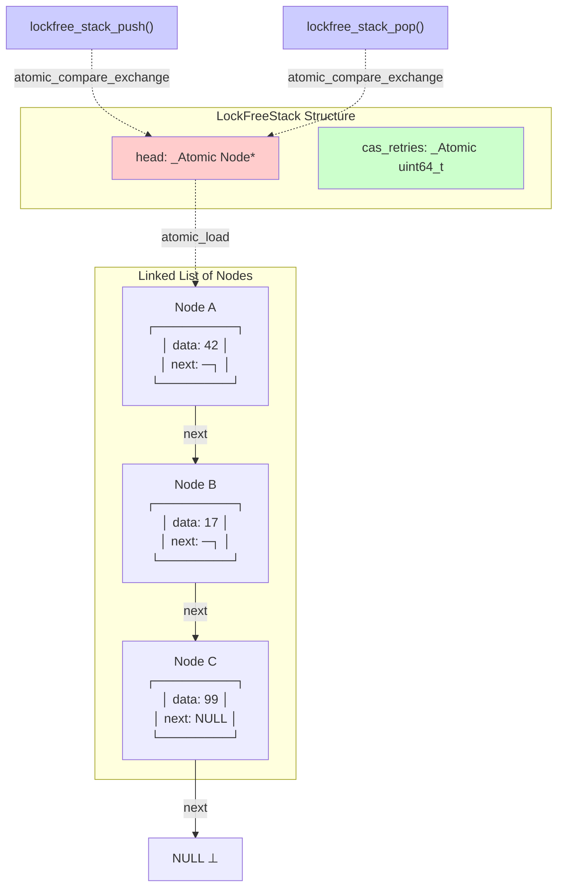
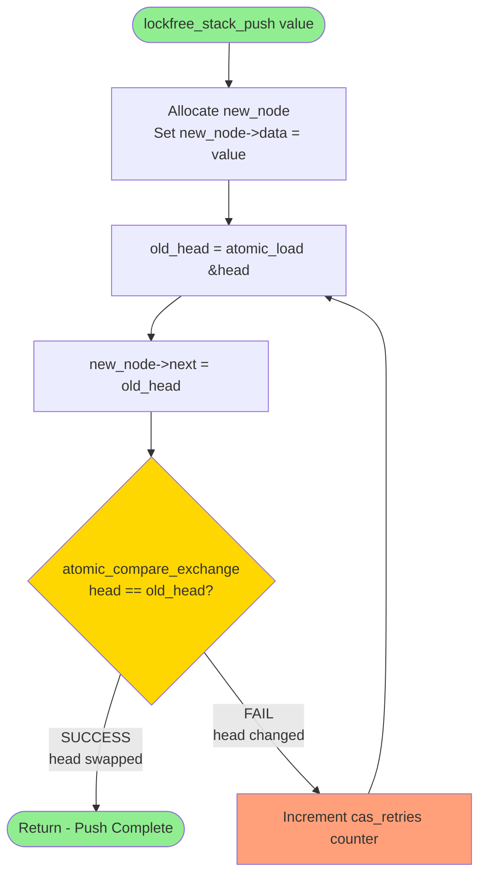
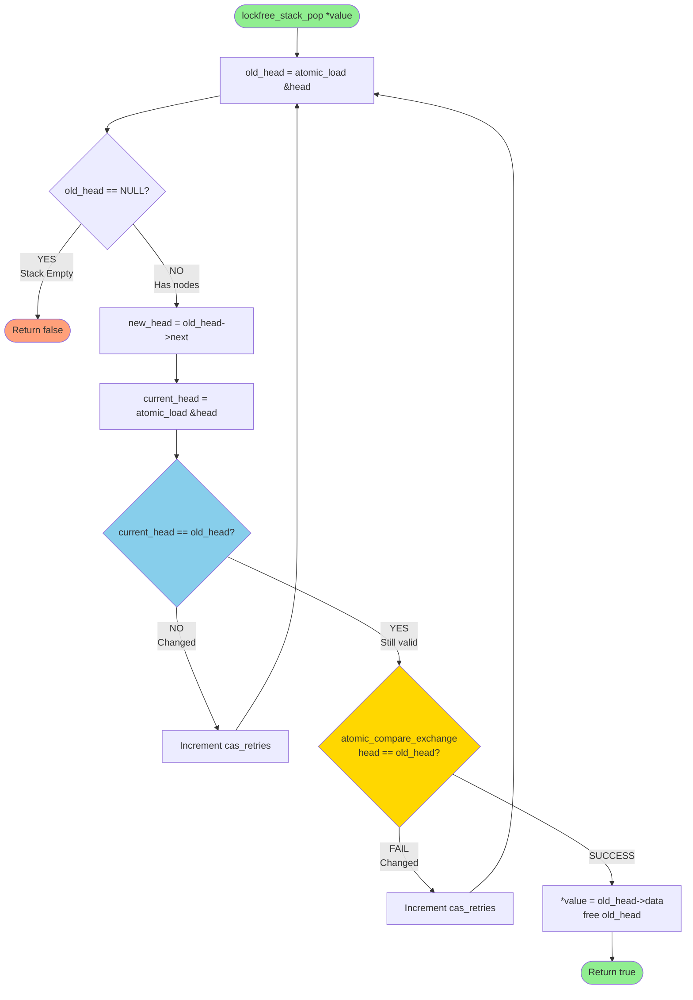
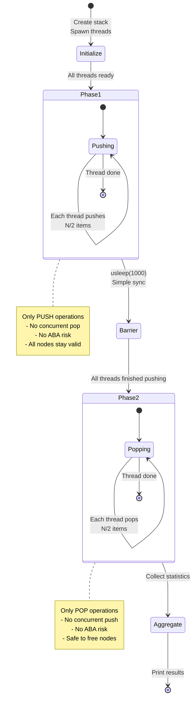
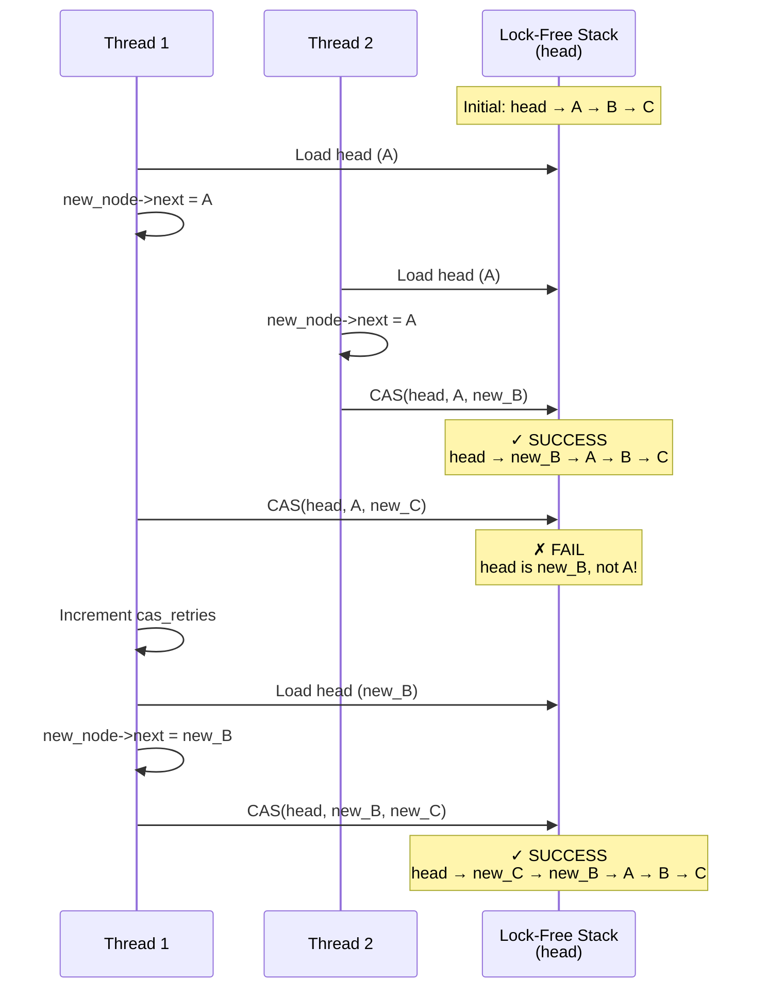

# Exercise 8: Lock-Free Stack - Visual Documentation

## Overview

This document provides visual explanations of the lock-free stack implementation in `exercise8.c` (the safe, phased version).

---

## 1. Lock-Free Stack Architecture



**Key Points:**
- `head` is an atomic pointer - can be read/written atomically
- All modifications use Compare-And-Swap (CAS)
- `cas_retries` tracks contention

---

## 2. Push Operation Flowchart



**Algorithm Explanation:**
1. Create new node with data
2. Read current head atomically
3. Point new node's `next` to current head
4. Try to CAS: if `head` still equals `old_head`, swap to `new_node`
5. If CAS fails (another thread changed head), retry from step 2
6. If CAS succeeds, push is complete

**Lock-Free Property:** Even if one thread is delayed, others can make progress.

---

## 3. Pop Operation Flowchart



**Algorithm Explanation:**
1. Read current head atomically
2. If NULL, stack is empty - return false
3. Read `old_head->next` to get new head
4. **Validate** head didn't change (prevents accessing freed memory)
5. Try to CAS: if `head` still equals `old_head`, swap to `new_head`
6. If CAS fails, retry from step 1
7. If CAS succeeds, extract value and free node

**Safety Note:** The validation step (green) prevents the race condition where another thread frees the node between reading head and reading next.

---

## 4. Phased Performance Test (Avoiding ABA)



**Why Phased?**
- **Phase 1 (Push only):** All threads only push - no pops happening, so no nodes are freed
- **Barrier:** Simple sleep ensures all threads finish pushing before any start popping
- **Phase 2 (Pop only):** All threads only pop - no new pushes, so no memory reuse

**Result:** ABA problem is avoided because we never have concurrent push/pop!

---

## 5. CAS Retry Sequence (Contention)



**What Happened:**
1. Both threads read head (A) simultaneously
2. Thread 2's CAS succeeds first
3. Thread 1's CAS fails (head changed to new_B)
4. Thread 1 retries with updated head value
5. Thread 1's second CAS succeeds

**Lock-Free Guarantee:** Thread 2 made progress even though Thread 1 was delayed!

---

## 6. Comparison: exercise8.c vs exercise8_aba.c

| Aspect | exercise8.c (Safe) | exercise8_aba.c (ABA Demo) |
|--------|-------------------|---------------------------|
| **Test Pattern** | Phased: Push → Barrier → Pop | Concurrent: 50% push, 50% pop interleaved |
| **Operations** | Phase 1: All push<br/>Phase 2: All pop | Each iteration: push OR pop |
| **Concurrency** | Push-only phase, then pop-only phase | Push and pop happening simultaneously |
| **ABA Risk** | ✗ **None** (no concurrent push/pop) | ✓ **High** (memory reuse during CAS) |
| **Memory Management** | ✓ Immediate free() in pop | ✗ Deferred (commented out free) |
| **Memory Leak** | ✗ None | ✓ **All popped nodes leaked** |
| **Crashes** | ✗ None | ✗ None (leak prevents double-free) |
| **CAS Retries** | Lower (less contention) | Higher (more contention) |
| **Purpose** | Demonstrate lock-free performance | Demonstrate ABA problem |
| **Production Readiness** | Closer (phasing is valid pattern) | Educational only |

---

## 7. Performance Metrics Explained

### Throughput
```
Throughput = Total Operations / Execution Time
```
- Measures ops/sec
- Higher = better
- Lock-free often wins under contention

### CAS Retry Rate
```
Retry Rate = cas_retries / Total Operations * 100%
```
- Indicates contention level
- 0% = no contention (all CAS succeed first try)
- 10-20% = moderate contention
- >50% = high contention

### Latency
```
Average Latency = Total Time / Total Operations
```
- Time per operation
- Lower = better
- Lock-free has more predictable worst-case

---

## 8. Thread Timeline (4 Threads, Phased)

```
Time  →
      0ms        500ms      1000ms     1500ms
      │          │          │          │
T1:   [─ Push ─>][── Pop ──>]
T2:   [─ Push ─>][── Pop ──>]
T3:   [─ Push ─>][── Pop ──>]
T4:   [─ Push ─>][── Pop ──>]
      └─Phase 1──┘└─Phase 2──┘
                 ▲
                 │
              Barrier
           (usleep 1ms)

Stack State:
t=0:     Empty
t=500:   Full (all pushes done)
t=1000:  Empty again (all pops done)
```

**Key Insight:** At barrier time, all pushes complete before any pops start!

---

## Summary

**exercise8.c demonstrates:**
- ✅ Lock-free stack works correctly
- ✅ CAS-based synchronization
- ✅ Better performance than mutex under contention
- ✅ No priority inversion
- ✅ Safe memory management (phased approach avoids ABA)

**Not demonstrated here (see exercise8_aba.c):**
- ❌ ABA problem (intentionally avoided)
- ❌ Memory reclamation challenges

**For ABA problem visualization, see `exercise8_aba_diagrams.md`**
